# Homevy

Project ini dibuat untuk pengumpulan final project kegiatan kampus merdeka NF Computer  

### Syarat yang harus dipenuhi:  

- [x] Boleh menggunakan library 3rd party
- [x] Base widget bebas (boleh Cupertino, Material, atau yang lain seperti Fluent)
- [x] Menerapkan Stateful dan Stateless widget
- [x] Gunakan workflow Git untuk kolaborasi
- [x] UI tidak ada overflow
- [x] Menerapkan responsive layout
- [x] Test coverage >= 40%
- [x] Menerapkan github action (untuk testing dan deployment)

### Bonus nilai:  

- [x] Menerapkan state management
- [x] Menerapkan design pattern

### Features

- GetX State Management
- Consume RESTful API
- Flutter Unit Test With Mockito
- Responsive Mobile and Desktop Layout

### Preview in Mobile

|                                                       |                                                       |
| ----------------------------------------------------- | ----------------------------------------------------- |
| Splash Page                                           | Login Page                                            |
|      |        |
| Register Page                                         | Home Page                                             |
|  |          |
| Detail Page                                           | Wishlist Page                                         |
| 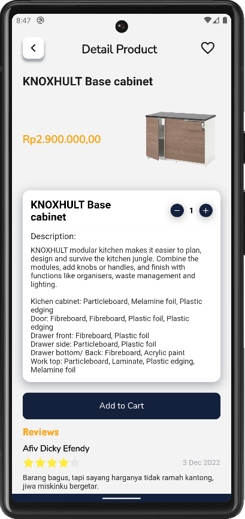     | 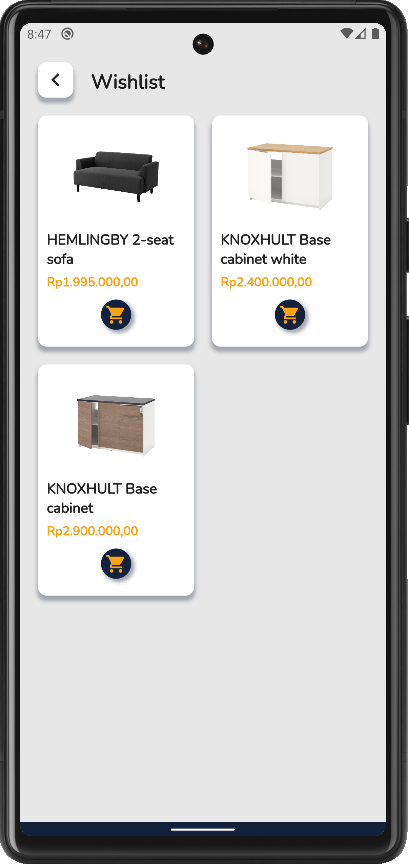 |
| Cart Page                                             | Checkout Page                                         |
| 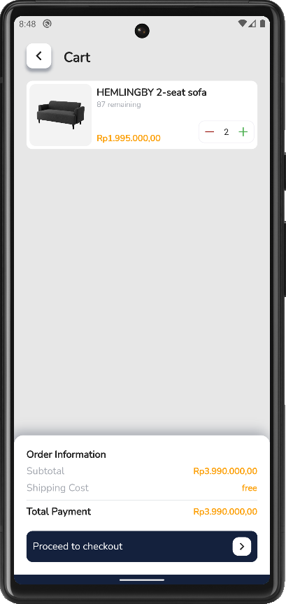         | 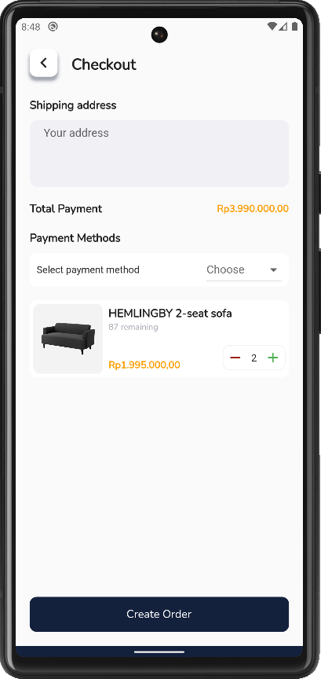 |
| Transaction Page                                      | Rate Page                                             |
| 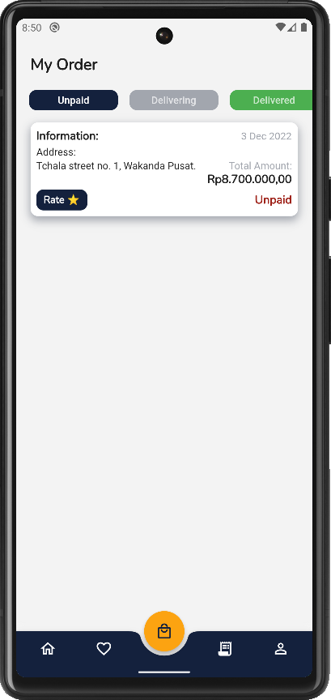 | 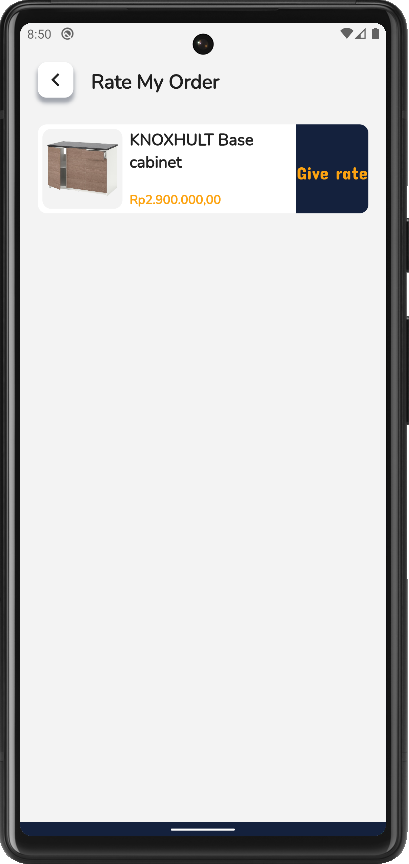         |
| Rate Field                                            | Profile Page                                          |

### Preview in Web

|                                                             |                                                       |
| ----------------------------------------------------------- | ----------------------------------------------------- |
| Splash Page                                                 | Login Page                                            |
|            |        |
| Register Page                                               | Home Page                                             |
|        | 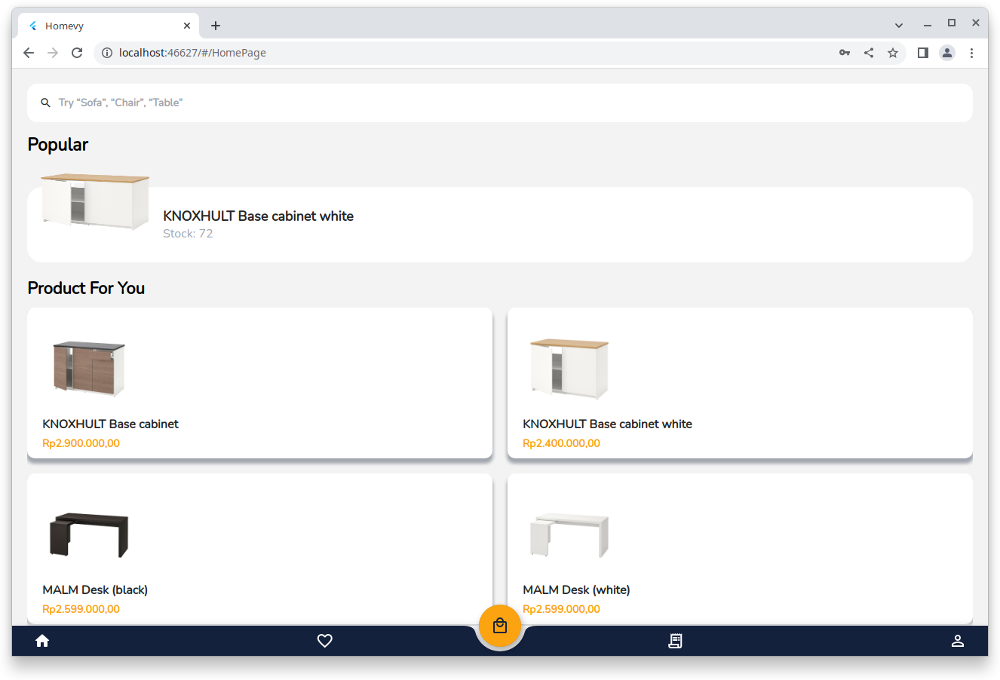         |
| Detail Page                                                 | Wishlist Page                                         |
| 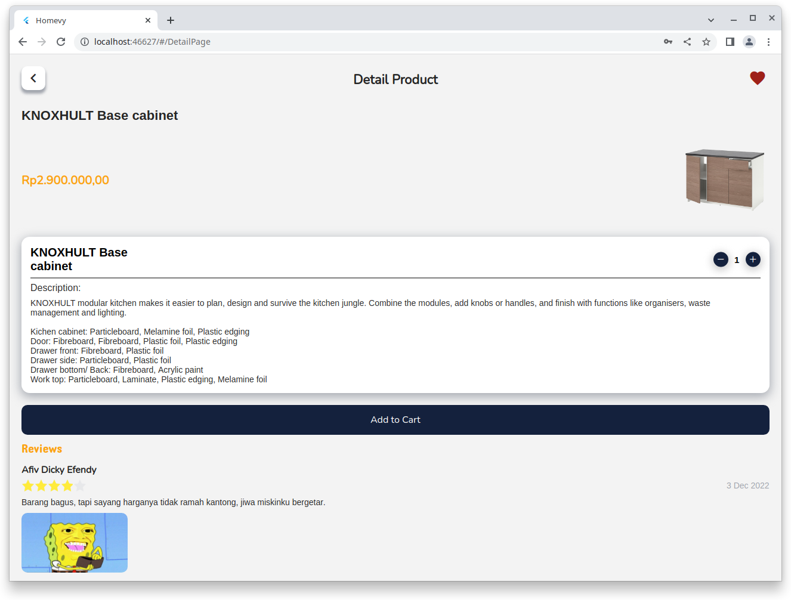           | 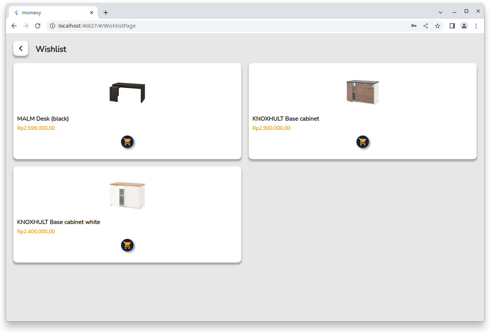 |
| Cart Page                                                   | Checkout Page                                         |
| 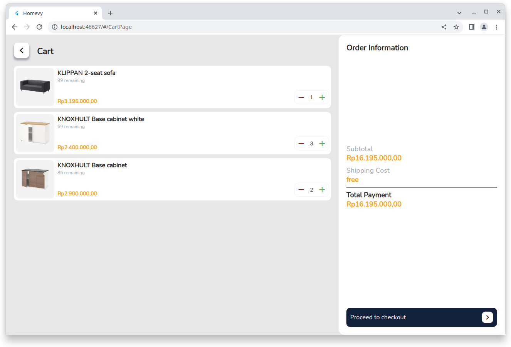               | 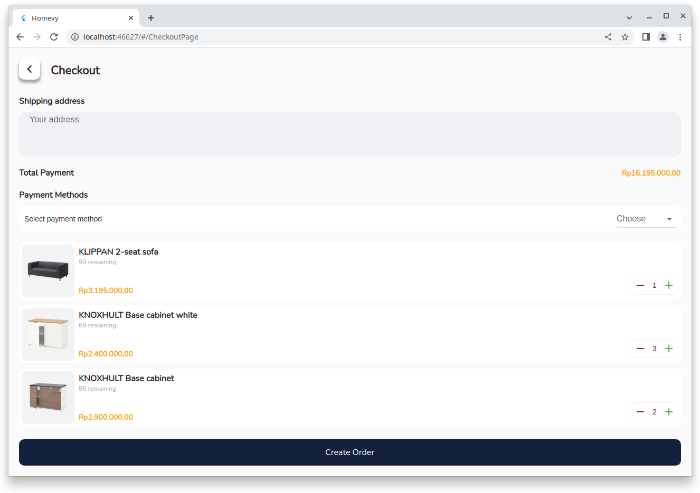 |
| Transaction Page                                            | Profile Page                                          |
| 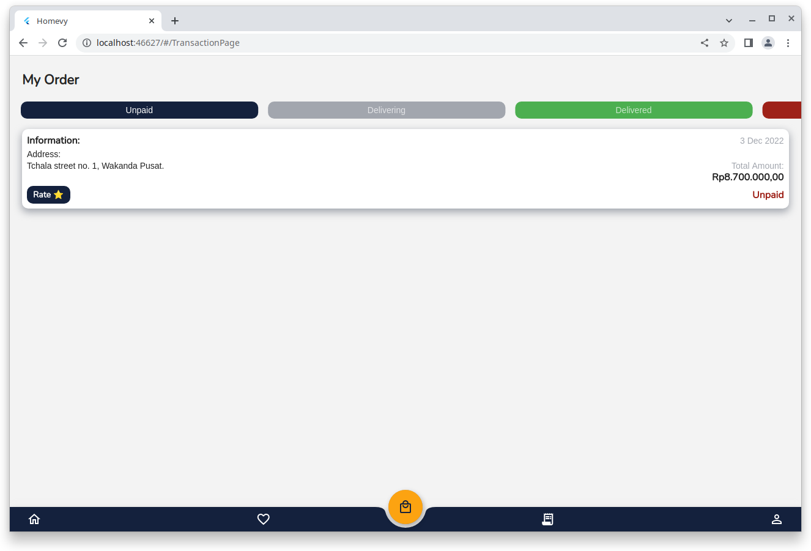 | 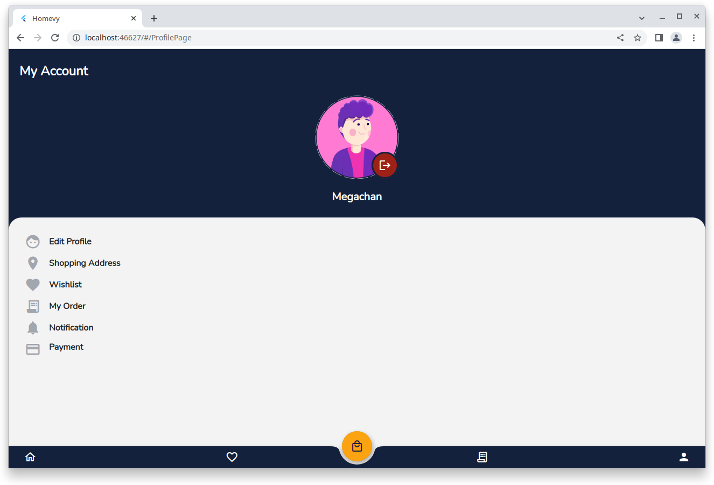   |
